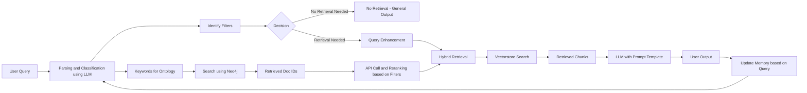

# KnowledgeSpace AI Agent - Dataset Search Assistant

A web application that provides an AI-powered chatbot interface for dataset discovery, using Google Gemini API on the backend and a React-based frontend.

## Table of Contents

- [Prerequisites](#prerequisites)
- [Setup](#setup)
  - [Clone the repository](#1-clone-the-repository)
  - [Install UV package manager](#2-install-uv-package-manager)
  - [Configure environment variables](#3-configure-environment-variables)
  - [Create and activate virtual environment](#4-create-and-activate-a-virtual-environment)
  - [Install dependencies](#5-install-backend-dependencies)
  - [Frontend setup](#6-install-frontend-dependencies)
- [Database Setup](#database-setup)
  - [Google Cloud Setup](#google-cloud-setup)
  - [BigQuery and Vertex AI Configuration](#bigquery-and-vertex-ai-configuration)
- [Running the Application](#running-the-application)
  - [Backend](#backend-port-8000)
  - [Frontend](#frontend-port-5000)
  - [Docker Setup](#docker-setup)
- [Data Processing Pipeline](#data-processing-pipeline)
- [Deployment](#deployment)
  - [Docker Compose + Caddy Deployment](#docker-compose--caddy-deployment)
- [API Documentation](#api-documentation)
  - [Endpoints](#endpoints)
  - [Error Responses](#error-responses)
- [Environment Configuration](#environment-configuration)

## Weblink For Interacting with Agent
https://chat.knowledge-space.org/

## Prerequisites

- **Python**: 3.11 or higher
- **Node.js**: 18.x or higher (for frontend development)
- **Google API Key** for Gemini
- **Google Cloud Platform Account** (for BigQuery and Vertex AI)
- **UV package manager** (for backend environment & dependencies)
- **Docker & Docker Compose** (optional, for containerized deployment)

## Setup

### 1. Clone the repository

```bash
git clone https://github.com/INCF/knowledge-space-agent.git
cd knowledge-space-agent
```

### 2. Install UV package manager

- **Windows**:
  ```bash
  pip install uv
  ```
- **macOS/Linux**:
  Follow the official guide:
  https://docs.astral.sh/uv/getting-started/installation/

### 3. Configure environment variables

Create a file named `.env` in the project root based on `.env.template`. You can choose between two authentication modes:

**Option 1: Google API Key (Recommended for development)**

- Set `GOOGLE_API_KEY` in your `.env` file

**Option 2: Vertex AI (Recommended for production)**

- Configure Google Cloud credentials and Vertex AI settings as shown in `.env.template`

> **Note:** Do not commit `.env` to version control.

### 4. Create and activate a virtual environment

```bash
# Create a virtual environment using UV
uv venv

**Windows (Command Prompt):**
.\venv\Scripts\activate

**Windows (PowerShell):**
.\venv\Scripts\Activate.ps1

### 5. Install backend dependencies

With the virtual environment activated:

```bash
uv sync
```

### 6. Install frontend dependencies

```bash
cd frontend
npm install

```


---

## Database Setup

### Google Cloud Setup

#### 1. Install Google Cloud CLI and Authenticate

```bash
# Install Google Cloud CLI
curl -O https://dl.google.com/dl/cloudsdk/channels/rapid/downloads/google-cloud-cli-linux-x86_64.tar.gz
tar -xf google-cloud-cli-linux-x86_64.tar.gz
./google-cloud-sdk/install.sh

# Initialize and authenticate
gcloud init
gcloud auth application-default login
```

---

### BigQuery and Vertex AI Configuration

The backend requires specific environment variables to connect to **Google Cloud services**, including **BigQuery** and **Vertex AI**. Configure the following variables in your `.env` file:

| Variable            | Description                          | How to Get It                              |
| ------------------- | ------------------------------------ | ------------------------------------------ |
| `GOOGLE_API_KEY`    | API key for Gemini models            | Generate from Google AI Studio             |
| `GEMINI_USE_VERTEX` | Toggle for Vertex AI vs standard API | Set to `false` for local development       |
| `GCP_PROJECT_ID`    | Google Cloud Project ID              | Required for Vertex AI and BigQuery        |
| `BQ_DATASET_ID`     | BigQuery dataset ID                  | Dataset containing KnowledgeSpace metadata |
| `INDEX_ENDPOINT_ID` | Vertex AI Vector Search endpoint     | ID of deployed vector index for RAG        |
| `ELASTIC_BASE_URL`  | Elasticsearch base URL               | URL of the text search engine              |

---


## Running the Application

#### Backend (port 8000)

In one terminal, from the project root with the virtual environment active:

```bash
uv run main.py
```

- By default, this will start the backend server on port 8000. Adjust configuration if you need a different port.

#### Frontend (port 5000)

In another terminal:

```bash
cd frontend
npm start
```

- This will start the React development server, typically on http://localhost:5000.

## Accessing the Application

Open your browser to:

```
http://localhost:5000
```

The frontend will communicate with the backend at port 8000.

### Docker Setup

#### Prerequisites

- Docker and Docker Compose installed
- `.env` file configured with required environment variables

#### Quick Start

To build and start both the backend and frontend in containers:

```bash
docker-compose up --build
```

**Frontend** → `http://localhost:3000`
**Backend health** → `http://localhost:8000/api/health`

#### Individual Container Management

**Backend only**:

```bash
docker build -t knowledge-space-backend ./backend
docker run -p 8000:8000 --env-file .env knowledge-space-backend
```

**Frontend only**:

```bash
docker build -t knowledge-space-frontend ./frontend
docker run -p 3000:3000 knowledge-space-frontend
```

## Data Processing Pipeline

This repository provides a set of Python scripts and modules to ingest, clean, and enrich neuroscience metadata from Google Cloud Storage, as well as scrape identifiers and references from linked resources.


## System Flow (High-Level)

The following diagram shows the high-level request and data flow through the system:

### Key Features

- **Elasticsearch Scraping**: The `ksdata_scraping.py` script harvests raw dataset records directly from our Elasticsearch cluster and writes them to GCS. It uses a Point-In-Time (PIT) scroll to page through each index safely, authenticating via credentials stored in your environment.

- **GCS I/O**: Download raw JSON lists from `gs://ks_datasets/raw_dataset/...` and upload preprocessed outputs to `gs://ks_datasets/preprocessed_data/...`.

- **HTML Cleaning**: Strip or convert embedded HTML (e.g. `<a>` tags) into plain text or Markdown.

- **URL Extraction**: Find and dedupe all links in descriptions and metadata for later retrieval.

- **Chunk Construction**: Build semantic "chunks" by concatenating fields (title, description, context labels, etc.) for downstream vectorization.

- **Metadata Filters**: Assemble structured metadata dictionaries (`species`, `region`, `keywords`, `identifier1…n`, etc.) for each record.

- **Per-Datasource Preprocessing**: Each data source has its own preprocessing script (e.g. `scr_017041_dandi.py`, `scr_006274_neuroelectro_ephys.py`) saved in `gcs://ks_datasets/preprocessed_data/`.

- **Extensible Configs**: Easily add new datasources by updating GCS paths and field mappings.

### Updating Vector Store with New Datasets

To update the vector store with new datasets from Knowledge Space, run:

```bash
python data_processing/full_pipeline.py
```

## Pipeline Process

The script performs a complete data processing workflow:

1. **Scrapes all data** - Runs preprocessing scripts to collect data from Knowledge Space datasources
2. **Generates hashes** - Creates unique hash-based datapoint IDs for all chunks
3. **Matches BigQuery datapoint IDs** - Queries existing data to find what's already processed
4. **Selects new/unique data** - Identifies only new chunks that need processing
5. **Creates embeddings** - Generates vector embeddings for new chunks only
6. **Upserts to vector store** - Uploads new embeddings to Vertex AI Matching Engine
7. **Inserts to BigQuery** - Stores new chunk metadata and content

This completes the update process with only new data, avoiding reprocessing existing content.

## Deployment

### Docker Compose + Caddy Deployment

#### Prerequisites

- **VM**: Debian/Ubuntu server with Docker & Docker Compose installed
- **Firewall**: Open ports 80 and 443 (http-server, https-server tags on GCP)
- **DNS**: Domain pointing to your server's external IP
- **SSL**: Caddy will auto-provision Let's Encrypt certificates

#### Deployment Steps

1. **Clean Previous Deployments**:

   ```bash
   cd ~/knowledge-space-agent || true

   # Stop current stack
   sudo docker compose down || true

   # Clean Docker cache and old images
   sudo docker system prune -af
   sudo docker builder prune -af

   # Optional: Clear HF model cache (will re-download on first use)
   sudo docker volume rm knowledge-space-agent_hf_cache 2>/dev/null || true

   # Stop host nginx if installed
   sudo systemctl stop nginx || true
   sudo systemctl disable nginx || true
   ```
2. **Create Required Configuration Files**:

   **Environment file**: Create `.env` based on `.env.template` with your specific values.

   **Caddy configuration (`Caddyfile`)**:

   ```
   your-domain.com, www.your-domain.com {
     reverse_proxy frontend:80
     encode gzip
     header {
       Strict-Transport-Security "max-age=31536000; includeSubDomains; preload"
     }
   }
   ```

   **Frontend Nginx**: The nginx configuration is already provided in `frontend/nginx.conf`.
3. **Deploy Stack**:

   ```bash
   cd ~/knowledge-space-agent
   sudo docker compose up -d --build
   sudo docker compose ps
   ```
4. **Verify Deployment**:

   ```bash
   # Check services are running
   sudo docker compose ps

   # Test local endpoints
   curl -I http://127.0.0.1/
   curl -sS http://127.0.0.1/api/health

   # Test public HTTPS
   curl -I https://your-domain.com/
   curl -sS https://your-domain.com/api/health
   ```

#### Daily Operations

**View logs**:

```bash
sudo docker compose logs -f backend
sudo docker compose logs -f frontend  
sudo docker compose logs -f caddy
```

**Update and redeploy**:

```bash
git pull
sudo docker compose up -d --build
```

**Status check**:

```bash
sudo docker compose ps
```

#### Troubleshooting

**Backend unhealthy**:

```bash
sudo docker inspect -f '{{json .State.Health}}' knowledge-space-agent-backend-1
```

**502/504 errors**:

```bash
sudo docker exec -it knowledge-space-agent-frontend-1 sh -c 'wget -S -O- http://backend:8000/health'
```

**DNS issues**:

```bash
dig +short your-domain.com
curl -s -H "Metadata-Flavor: Google" http://metadata/computeMetadata/v1/instance/network-interfaces/0/access-configs/0/external-ip
```

## API Documentation

### Base URL
- **Development**: `http://localhost:8000`
- **Production**: `https://your-domain.com`

### Endpoints

#### General

**GET /**
- **Description**: Root endpoint, returns service status
- **Response**:
  ```json
  {
    "message": "KnowledgeSpace AI Backend is running",
    "version": "2.0.0"
  }
  ```

**GET /health**
- **Description**: Basic health check for Docker/load balancers
- **Response**:
  ```json
  {
    "status": "healthy",
    "timestamp": "2024-01-01T12:00:00.000Z",
    "service": "knowledge-space-agent-backend",
    "version": "2.0.0"
  }
  ```

**GET /api/health**
- **Description**: Detailed health check with component status
- **Response**:
  ```json
  {
    "status": "healthy",
    "version": "2.0.0",
    "components": {
      "vector_search": "enabled|disabled",
      "llm": "enabled|disabled", 
      "keyword_search": "enabled"
    },
    "timestamp": "2024-01-01T12:00:00.000Z"
  }
  ```

#### Chat

**POST /api/chat**
- **Description**: Send a query to the neuroscience assistant
- **Request Body**:
  ```json
  {
    "query": "Find datasets about motor cortex recordings",
    "session_id": "optional-session-id",
    "reset": false
  }
  ```
- **Response**:
  ```json
  {
    "response": "I found several datasets related to motor cortex recordings...",
    "metadata": {
      "process_time": 2.5,
      "session_id": "default",
      "timestamp": "2024-01-01T12:00:00.000Z",
      "reset": false
    }
  }
  ```

**POST /api/session/reset**
- **Description**: Clear conversation history for a session
- **Request Body**:
  ```json
  {
    "session_id": "session-to-reset"
  }
  ```
- **Response**:
  ```json
  {
    "status": "ok",
    "session_id": "session-to-reset",
    "message": "Session cleared"
  }
  ```

### Error Responses

**504 Gateway Timeout**
```json
{
  "detail": "Request timed out. Please try with a simpler query."
}
```

**500 Internal Server Error**
```json
{
  "response": "Error: [error description]",
  "metadata": {
    "error": true,
    "session_id": "session-id"
  }
}
```

### Environment Configuration

For required environment variables, see `.env.template` in the project root.

## Additional Notes

- **Environment**: Make sure `.env` is present before starting the backend.
- **Ports**: If ports 5000 or 8000 are in use, adjust scripts/configuration accordingly.
- **UV Commands**:
  - `uv venv` creates the virtual environment.
  - `uv sync` installs dependencies as defined in your project’s config.
- **Troubleshooting**:
  - Verify Python version (`python --version`) and that dependencies installed correctly.
  - Ensure the `.env` file syntax is correct (no extra quotes).
  - For frontend issues, check Node.js version (`node --version`) and logs in terminal.
